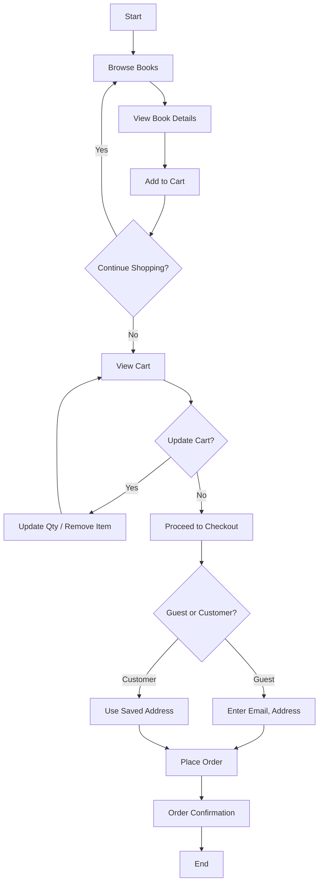
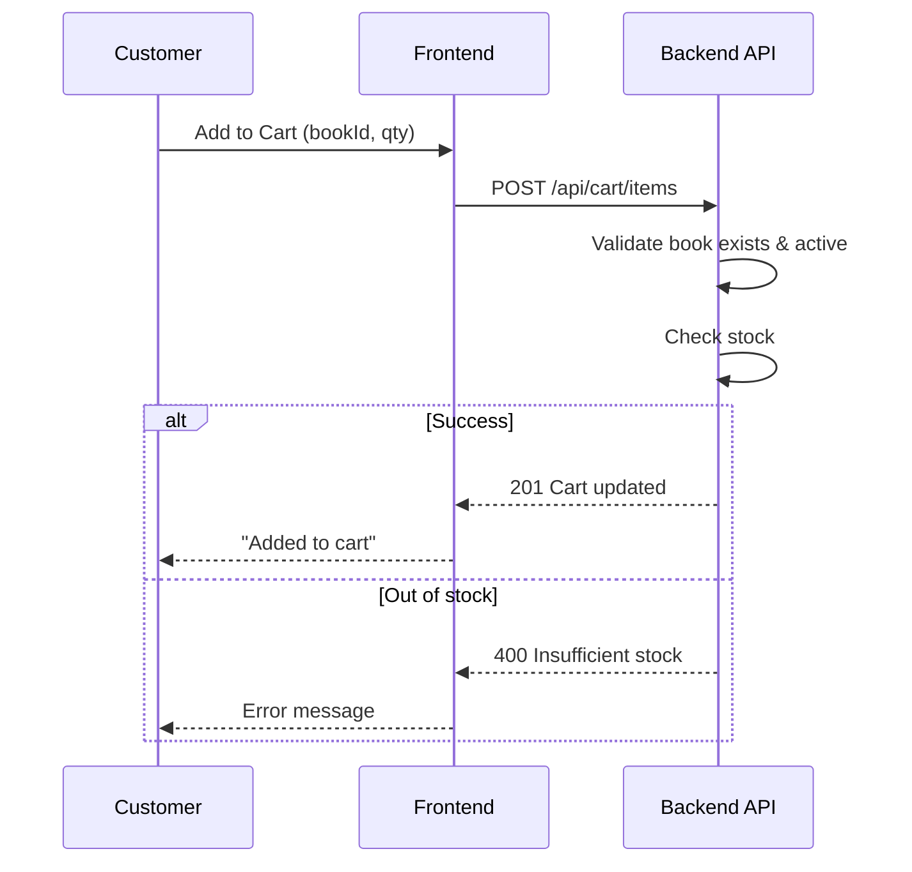
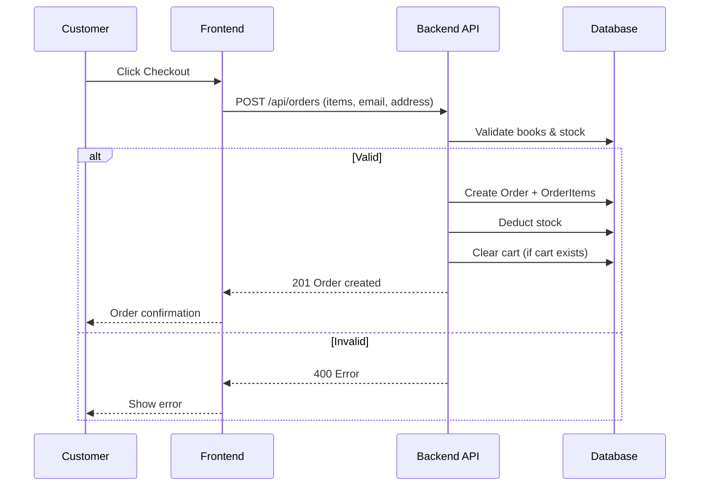
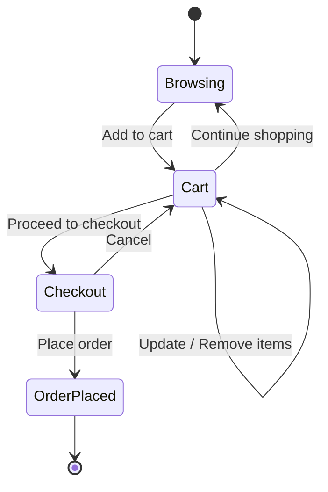

# Customer Order & Add to Cart Workflow

## Overview

This document describes the workflow for customers to browse books, add items to cart, and place orders. **Guests must log in to become customers before they can buy.**

---

## High-Level Flow



---

## Detailed Workflow

### 1. Browse Books

| Step | Action | API / Component |
|------|--------|-----------------|
| 1.1 | Customer opens book catalog | `GET /api/books` |
| 1.2 | Customer filters/searches (optional) | Future: `GET /api/books?search=&status=active` |
| 1.3 | Customer clicks on a book | `GET /api/books/{id}` |

### 2. Add to Cart

| Step | Action | API / Component |
|------|--------|-----------------|
| 2.1 | Customer selects quantity | User input |
| 2.2 | Customer clicks "Add to Cart" | `POST /api/cart/items` *(to be implemented)* |
| 2.3 | System validates book (active, in stock) | Backend validation |
| 2.4 | Cart updated (session or DB) | Store cart item |
| 2.5 | Show success message | UI feedback |



### 3. View & Manage Cart

| Step | Action | API / Component |
|------|--------|-----------------|
| 3.1 | Customer views cart | `GET /api/cart` |
| 3.2 | Update quantity | `PUT /api/cart/items/{bookId}` |
| 3.3 | Remove item | `DELETE /api/cart/items/{bookId}` |
| 3.4 | Cart shows subtotal | Calculated from items |

### 4. Checkout & Place Order

| Step | Action | API / Component |
|------|--------|-----------------|
| 4.1 | Customer clicks "Checkout" | Navigate to checkout |
| 4.2 | Guest: enter email, address, name | Form input |
| 4.3 | Customer: use saved profile (optional) | Pre-filled form |
| 4.4 | Submit order | `POST /api/orders` |
| 4.5 | System validates cart, stock, address | Backend validation |
| 4.6 | Create order, deduct stock | Order & OrderItem saved |
| 4.7 | Clear cart | Session/DB update |
| 4.8 | Show order confirmation | Order ID, total, status |



---

## Current vs Planned Implementation

| Feature | Status | API |
|---------|--------|-----|
| Browse books | ✅ Implemented | `GET /api/books`, `GET /api/books/{id}` |
| Place order (direct) | ✅ Implemented | `POST /api/orders` |
| Create cart | ✅ Implemented | `POST /api/cart` |
| Get cart | ✅ Implemented | `GET /api/cart/{cartId}` |
| Add to cart | ✅ Implemented | `POST /api/cart/{cartId}/items` |
| Update cart item | ✅ Implemented | `PUT /api/cart/{cartId}/items/{bookId}` |
| Remove from cart | ✅ Implemented | `DELETE /api/cart/{cartId}/items/{bookId}` |
| Checkout from cart | ✅ Implemented | `POST /api/orders/from-cart/{cartId}` |

---

## Cart Data Model (Proposed)

```
Cart
├── cartId
├── customerId (null for guest)
├── sessionId (for guest)
└── CartItem[]
    ├── bookId
    ├── quantity
    └── priceAtAdd (snapshot)
```

---

## State Diagram: Cart → Order


